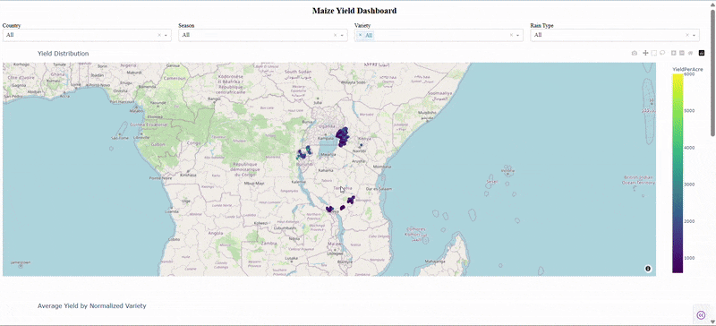
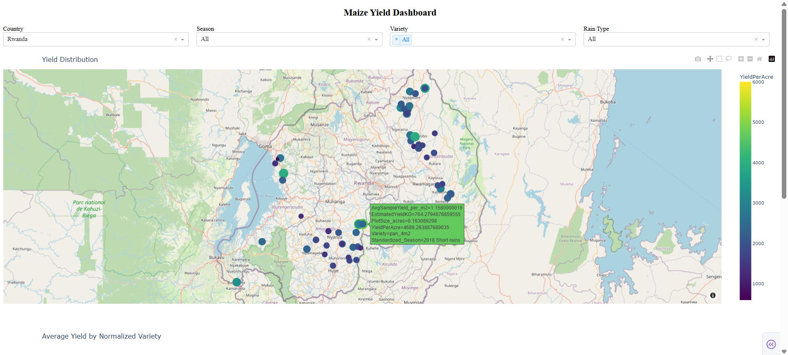
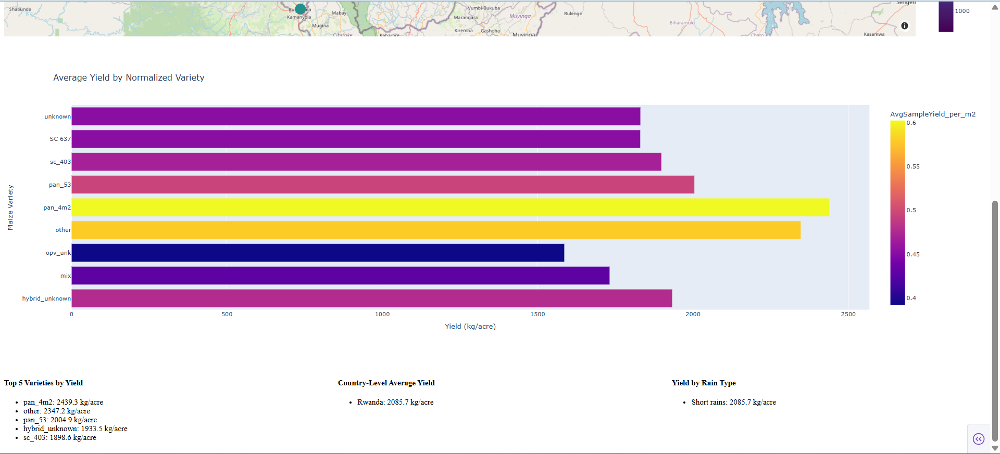

AgroDashboard

An interactive agronomic dashboard built with Plotly Dash to explore maize yield data across East Africa. Apply spatial, temporal, and categorical filters, view normalized variety performance, and surface key insights through maps, bar charts, and summary panels.

---

### 🛠️ Tech Stack

---

### 🎞️ Dashboard Demo

---

### 📊 Dashboard Preview

---

Features

📍 Interactive Map

Automatically centers and zooms to fit all farmer plots

Jittered coordinates for clarity

Color-coded by YieldPerAcre, sized by AvgSampleYield\_per\_m2

---

🗺️ Filters

Country (All / Kenya / Tanzania / Rwanda)

Season (Standardized\_Season)

Variety (raw and normalized grouping)

Rain Type (Short rains / Long rains)

---

🔍 Hover Pop-Out

EstimatedYieldKG

PlotSize\_Acres

YieldPerAcre

Variety

Standardized\_Season

---

📊 Bar Chart

Average yield by normalized variety

Dynamic height scaling based on number of varieties

Merges variants like DK8031, DK\_8031, DK 8031

---

📋 Summary Panels

Top 5 varieties by average yield

Country-level average yields

Yield by rain type

---

⚙️ Data Processing

Cleans and normalizes variety names

Drops records with missing coordinates or yield

Imputes minimal sample yield for plotting

---

### 🎯 Use Cases

**👩‍🌾 Agronomists & Field Officers**
- Compare yield performance across seasons, varieties, and rainfall conditions
- Identify spatial patterns and outliers using clustering and map overlays
- Plan targeted field interventions based on granular, normalized insights

**📈 Donors & Funders**
- Visualize geographic impact and outcomes across program locations
- Evaluate the effectiveness of agronomic interventions over time
- Support data-backed proposals and grant reporting with visual metrics

**🛠️ Data Analysts & Engineers**
- Leverage structured agronomic data to refine models and dashboards
- Explore clustering techniques and geospatial mapping within Plotly Dash
- Build scalable pipelines from field data to front-end storytelling

**🎓 Researchers & Academics**
- Conduct exploratory analysis on environmental factors vs. yield
- Incorporate spatial filtering and metadata into agronomic studies
- Share insights with a broader audience through interactive visualization

---
